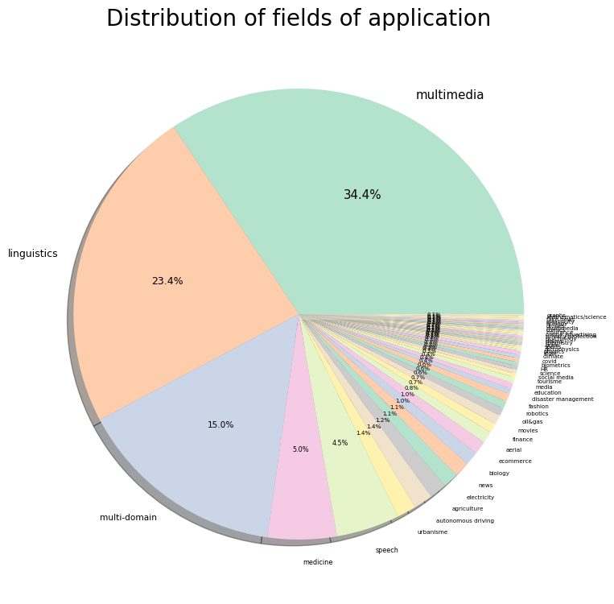
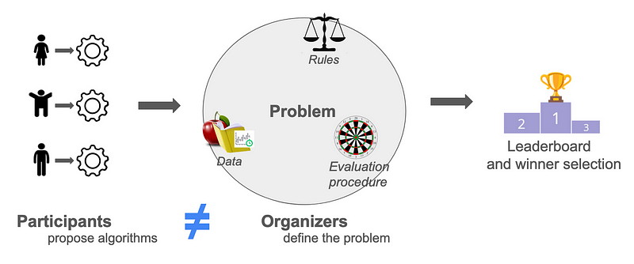
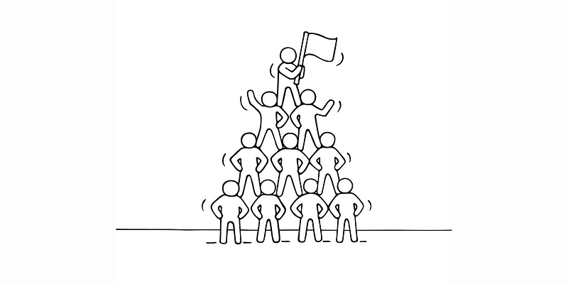

Hosting a competition or a benchmark is a way to effectively address complex problems in artificial intelligence. Having independant participants encourage performance and innovation, while avoiding what is known as “inventor-evalutor bias”. It is also a nice and modern way to promote your organization. Let’s explore the benefits of organizing such challenges.

## What are challenges?

Machine learning challenges are events where individuals or teams develop models to solve specific problems. It is a form of crowdsourcing, where participants from around the world are invited to contribute diverse approaches. Winners are typically awarded prizes, which can range from monetary awards to recognition within the industry, incentiving participation and innovation. As shown in the pie chart below, competitions can be used to tackle problems in a wide variety of fields of applications, mainly linguitics (NLP) and multimedia (computer vision), but also medicine, agriculture, finance, robotics, education and more.

In 2022, more than 200 competitions were organized, with a total prize pool exceeding $5,000,000 (Carlens, 2023). Nowadays, competitions are part of major international conferences such as NeurIPS and ICML. There are many different competition platforms, including Kaggle, CodaLab, Codabench, EvalAI, RAMP, and Tianchi.

*Distribution of fields of application of competitions organized on CodaLab Competitions (Pavão, 2023).*

## Avoiding inventor-evaluator bias

A significant benefit of crowdsourced challenges lies in its ability to
create a uniform evaluation process for all candidate models, regardless of
their authors. This method ensures unbiased and fair benchmarking, effectively preventing any “inventor-evaluator bias”, or “self-assessment trap” (Norel et al., 2011), where the problem could be manipulated to favor a specific solution. Using a fixed evaluation procedure for all submissions also improves the general reproducibility of experiments.

Participants and organizers are two independent groups, preventing any manipulation of the problem that could unfairly advantage one model over another.

## Encouraging performance and innovation

When participants compete to find the best solution, it drives performance and sparks innovation. This method uses crowdsourcing effectively, letting the best model emerge from all proposed solutions. From the point of view of participants, they can dive into the problem without having to worry about preparing data or setting up the problem. This not only makes things easier for them but also brings in a variety of high-quality solutions.

## Promoting your organization

Challenges are a cool and effective way for companies to promote themselves, whether they’re held online or in person at conferences and award ceremonies. They attract talented individuals who might be potential hires and help in building a community around the organization’s interests. Although many teams compete, the cost of the award is relatively modest compared to the benefits of having numerous teams tackle the problem, with only one winning. For participants, it’s a great opportunity to engage with a specially designed problem and gain exposure to interesting opportunities in the field. Consider hosting one!

## Conclusion

In conclusion, organizing machine learning competitions and benchmarks offers significant benefits. They help avoid biases in evaluation, boost performance and innovation, and promote your organization. Additionally, these events are powerful tools for attracting top talent, incentivizing them to participate in an engaging way. Through challenges, we can drive the field of AI forward, creating both technological advancements and collaborative opportunities.

## References

Harald Carlens. [State of competitive machine learning in 2022. ML Contests](https://mlcontests.com/state-of-competitive-machine-learning-2022/), 2023.

Adrien Pavão. [Methodology for Design and Analysis of Machine Learning Competitions](https://theses.hal.science/tel-04401932v1). PhD thesis, Université Paris-Saclay, December 2023.

Raquel Norel, John Jeremy Rice, and Gustavo Stolovitzky. The self-assessment trap : can we all be better than average ? Molecular systems biology, 2011.

_Original content by [Adrien Pavão](https://adrienpavao.com/)._
