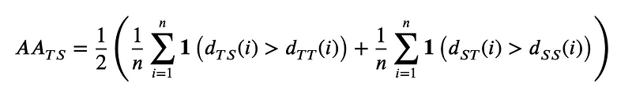

Machine learning has undoubtedly become a powerful tool in today’s data-driven world, but are we truly tapping into its full potential? Traditional evaluation metrics like accuracy, precision, and recall have long held the spotlight, but there’s so much more to consider when measuring a model’s real-world impact. In this article, we’ll dive into the lesser-known, unconventional metrics that are reshaping the way we assess machine learning models. From fairness, privacy and calibration, to enery consumption, data consumption or even psychological and behavioral tests, these innovative evaluation techniques will change how you think about model performance and pave the way for a more responsible, holistic approach to machine learning.

## Fairness

Even if the mathematical definition of machine learning models does not necessarily contains unfair or biased elements, trained models can be unfair, depending on the quality of their input data or their training procedure. A model learned on biased data may not only lead to unfair and inaccurate predictions, but also significantly disadvantage certain subgroups, and lead to unfairness. 
In another words, the notion of fairness of models describe the fact that models can behave differently on some subgroups of the data. The issue is especially significant when it pertains to demographic groups, commonly defined by factors such as gender, age, ethnicity, or religious beliefs. As machine learning is increasingly applied in the society, this problem is getting more attention and research [1, 2, 3, 4, 5]. Quantifying fairness in machine learning is subject to debate. Some interesting ways to measure fairness include:

**Demographic Parity**: This measure checks if the positive classification rate is equal across different demographic groups. The formula is as follows:

where A is a protected attribute (such as race or gender), Y is the target variable (such as approval or denial).

**Statistical Parity Difference**: This measures if the positive classification rate is equal across different demographic groups. The formula is:

where Ŷ is the predicted value of Y.

**Disparate impact**: It calculates the ratio of the positive classification rate for a protected group to the positive classification rate for another group.

A value of 1 indicates that the positive classification rate is the same for both groups, suggesting fairness. A value greater than 1 indicates a higher positive classification rate for the group with A=0, while a value less than 1 suggests a higher positive classification rate for the group with A=1.  
However, it is important to note that disparate impact is a limited measure of fairness and should not be used in isolation. There may be cases where a higher positive classification rate for one group is justifiable, for example if the group is underrepresented in the training data. Additionally, disparate impact does not consider other factors such as false positive and false negative rates, which may provide a more comprehensive view of fairness.

These are just a few of the metrics that can be used to quantify fairness in machine learning. It is important to note that fairness is a complex issue, and these metrics should not be used in isolation. Instead, they should be considered in the context of the specific problem and the desired outcome.

## Calibration

As defined in [6, 7], the notion of miscalibration represents the difference in expectation between the confidence level (or probability) returned by the algorithm, and the actual performance obtained.  
In other words, calibration measurement answers the following question: is the confidence of the algorithm about its own predictions correct?  
Promoting well calibrated models is important in potentially dangerous decision making problems, such as disease detection or mushroom identification.  
The importance of calibration measurement lies in the fact that it is essential to have a clear understanding of the confidence level that the algorithm has in its own predictions. A well-calibrated algorithm will produce confidence levels that accurately reflect the likelihood of a prediction being correct. In contrast, a miscalibrated algorithm will either over or under estimate its confidence in its predictions, leading to incorrect or unreliable outcomes.  
In applications where the consequences of incorrect decisions can be severe, such as disease detection or mushroom identification, it is of utmost importance to have a well-calibrated algorithm. Misclassification of a disease can lead to incorrect medical treatment and harm to the patient. Similarly, misidentification of a mushroom can result in serious health consequences. In these scenarios, well-calibrated models can help ensure that the right decisions are made based on reliable predictions.

It can be computed using the **Expected Calibration Error** (ECE): This score measures the difference between the average predicted probability and the accuracy (i.e., the proportion of positive samples) in bins of predicted probability. The formula for the ECE is given by:

where M is the number of bins, Bm is the set of samples in the m-th bin, n is the total number of samples in the test data, accm is the accuracy of the m-th bin, and confm is the average predicted probability in the m-th bin.

## Variance

The variance itself can be used as a secondary objective metric. The variability of the performance of the algorithms is something that we want to minimize. It can be simply computed using the standard deviation σ of the average score. It can also be defined as the rate of convergence: when re-trained n times, how many times the algorithm does converge to a satisfying solution? Using these calculations as a secondary objective metrics does not mean to take into account error bars of the scores when ranking the models, but to rank the models based on the variance, or at least to break ties by giving advantage to the more stable candidate model.  
The variance of a machine learning model’s performance is an important secondary objective metric that should not be overlooked. Variability in the performance of algorithms can result in unreliable and inconsistent outcomes. Minimizing this variability is crucial for ensuring the stability and robustness of the model.

There are several ways to measure the variance of a machine learning model. One common method is to calculate the standard deviation of the average score of the model over multiple runs or folds. This provides a measure of the spread of the performance around the average and indicates how much the performance may vary in different situations.
The formula for the standard deviation of the average score of the model is given by:

where n is the number of runs or folds, xi is the performance score of the model in the i-th run or fold, and x̄ (x bar) is the average performance score across all runs or folds.

## Interpretability and explainability

Interpretability and explainability are related but distinct concepts in machine learning.

**Interpretability** refers to the degree to which a human can understand the cause of a model’s predictions. It refers to the ability to understand the internal workings of the model and how it arrived at its decisions.

**Explainability** refers to the ability to provide a human-understandable explanation of the model’s decision making process. It is concerned with the presentation of the reasons behind the predictions to humans in a understandable form, e.g., through feature importance, decision trees, etc.

In summary, interpretability focuses on the transparency of the model itself, while explainability focuses on the communication of the model’s behavior to a human audience.

A wide survey on interpretability is proposed by [8]. They stressed out how interpretability is greatly valuable in one hand, but hard to define in the other hand. Another way to explain algorithms, automatically, is the sensitivity analysis [9]. Sensitivity analysis is a technique used to determine how changes in input variables of a model or system affect the output or outcomes of interest.

## Privacy

Privacy should be measured in the case where the candidates algorithms are generative models, modelling a distribution of potentially confidential data. The goal in such case is to use the generative models in order to create artificial data that reassembles sufficiently the real data to use it in actual applications, but not too much so that private information are leaked. A metric that compute exactly this is the adversarial accuracy [10]. Here is its definition:

where the indicator function 1 takes value 1 if its argument is true and 0 otherwise, T and S are true and synthetic data respectively.

It is basically the accuracy of a 1-nearest-neighbor classifier, but the score we are aiming at is not 1 (perfect classification accuracy) but 0.5. Indeed, a perfect score means that each generated data point has its closest neighbor in the real data, which means that the two distributions are too close. A score of 0 would mean that the two distributions are too different so the utility is low. Hence, a 0.5 score, where the closest neighbor of each data point can either be fake or real with the same probability, is what guarantee a good privacy.

One limitation of this method is that a proper measure of distance is needed. This is also a strength because it means that the method is general and can be applied in different fields, by selecting an adequate distance measure.

## Time and memory consumption

Simple and useful secondary objective metrics are the consumption of time, memory and energy of the models. There are two main approaches to take it into account: limit the resources and track the use of resources.

The training and inference time, the size of the model, the memory used during the process or even the energy consumption are variables that can be limited by design or measured.
The number of lines of code, or the number of characters, of a method can also be used as an indicator of the simplicity and practicability of the solution. However, obviously, this indicator can be easily tricked by calling external packages and may need a manual review.
The simplest models that solve the task is preferable, are they are better for the environment, less costly, can be deployed in weaker devices and are easier to interpret.

A model that can produce the same results in less time is more desirable, as it reduces the computational resources required and can lead to cost savings. This is especially important in light of the current ecological crisis, as reducing energy consumption in computing can have a significant impact on reducing the carbon footprint of technology. Additionally, models that are faster to train and make predictions are more scalable and can be deployed in real-time applications, further enhancing their utility. Thus, optimizing time consumption is a key factor in the development of efficient and environmentally sustainable machine learning models.

## Data consumption

Data consumption, or the amount of training data required by a machine learning algorithm, is another crucial metric to consider when comparing different models. As the saying goes, “data is the new oil”, but not every situation allows for the luxury of vast datasets. In many real-world applications, gathering sufficient labeled data can be time-consuming, expensive, or even impossible. Tracking and limiting data consumption is, therefore, an essential aspect of model evaluation.

Monitoring data consumption can help identify algorithms that perform well with limited data, making them more suitable for scenarios with data scarcity or for faster deployment. On the other hand, constraining the quantity of available training data can encourage the development of models that are more efficient in learning from smaller samples. This is typically called few-shots learning. This is where meta-learning techniques, like the k-shot n-way approach, come into play. In this method, models are trained to quickly adapt to new tasks using only a limited number of examples k from each class n. 
By intentionally limiting data consumption, meta-learning promotes the development of models capable of generalizing better from smaller datasets, ultimately enhancing their utility and adaptability in diverse situations.

## Human-centric approaches

In addition to the quantitative evaluation metrics discussed earlier, it is essential to consider more “human” evaluation techniques when assessing machine learning models. These approaches place emphasis on qualitative aspects and subjective interpretation, bringing a human touch to the evaluation process. For instance, in the case of text-to-image algorithms, manual assessment of generated images can help determine whether the outcomes are visually appealing, coherent, and contextually relevant. Similarly, large language models can be subjected to psychological or behavioral tests, where human evaluators rate the model’s responses based on factors like coherence, empathy, and ethical considerations. Such human-centric evaluation methods can reveal insights that purely numerical metrics might overlook, providing a more nuanced understanding of a model’s strengths and weaknesses. By integrating these human-oriented techniques into our evaluation toolbox, we can ensure that our machine learning models are not only effective in solving problems but also resonate with the complex and multifaceted nature of human experiences and expectations.

Following this idea, a clear example is how the Generative Pre-trained Transformers (GPT) [11], the famous large language models, was tested using psychology tests [12, 13], high-school tests [14] and mathematics tests [15].

## Conclusion

In conclusion, evaluating machine learning models goes far beyond traditional accuracy metrics. By embracing a holistic approach, we can better understand the various dimensions of a model’s performance and its impact on the real world. By exploring unconventional metrics such as fairness, privacy, energy consumption, calibration, time, memory, and data consumption, we can drive the development of more responsible, efficient, and adaptable models that address the diverse challenges we face today.

It is crucial to recognize that no one-size-fits-all solution exists when it comes to machine learning. By broadening our evaluation criteria and shedding light on these lesser-known metrics, we can foster innovation in the field, ensuring that our models not only perform well but also align with ethical considerations and practical constraints. As we continue to push the boundaries of machine learning, let us strive to create models that not only solve complex problems but also do so in a way that is responsible, equitable, and mindful of the world we live in.

## References

[1] Philipp Benz, Chaoning Zhang, Adil Karjauv, and In So Kweon. Robustness may be at odds with fairness: An empirical study on class-wise accuracy. 2020. URL https://arxiv.org/abs/2010.13365.

[2] Mariya I. Vasileva. The dark side of machine learning algorithms: How and why they can leverage bias, and what can be done to pursue algorithmic fairness. In 26th ACM SIGKDD Conference on Knowledge Discovery and Data Mining, Virtual Event, CA, USA. ACM, 2020. URL https://doi.org/10.1145/3394486.3411068.

[3] Alexandra Chouldechova and Aaron Roth. The frontiers of fairness in machine learning. 2018. URL http://arxiv.org/abs/1810.08810.

[4] Irene Y. Chen, Fredrik D. Johansson, and David A. Sontag. Why is my classifier discriminatory? In Neural Information Processing Systems (NeurIPS) 2018, Montréal, Canada. URL https://proceedings.neurips.cc/paper/2018/hash/1f1baa5b8edac74eb4eaa329f14a0361-Abstract.html.

[5] Ludovico Boratto, Gianni Fenu, and Mirko Marras. Interplay between upsampling and regularization for provider fairness in recommender systems. User Model. User Adapt. Interact., 2021. URL https://doi.org/10.1007/s11257–021–09294–8.

[6] Mahdi Pakdaman Naeini, Gregory F. Cooper, and Milos Hauskrecht. Obtaining well calibrated probabilities using bayesian binning. In Proceedings of the Twenty-Ninth AAAI Conference on Artificial Intelligence, 2015, Austin, Texas, USA. URL http://www.aaai.org/ocs/index.php/AAAI/AAAI15/paper/view/9667.

[7] Chuan Guo, Geoff Pleiss, Yu Sun, and Kilian Q. Weinberger. On calibration of modern neural networks. In Proceedings of the 34th International Conference on Machine Learning, ICML 2017, Sydney, NSW, Australia, volume 70 of PMLR 2017. URL http://proceedings.mlr.press/v70/guo17a.html.

[8] Diogo V. Carvalho, Eduardo M. Pereira, and Jaime S. Cardoso. Machine learning interpretability: A survey on methods and metrics. MDPI Electronics, 2019. URL https://www.mdpi.com/2079–9292/8/8/832/pdf.

[9] Bertrand Iooss, Vincent Chabridon, and Vincent Thouvenot. Variance-based importance measures for machine learning model interpretability. In Actes du Congrès, 2022. URL https://hal.archives-ouvertes.fr/hal-03741384.

[10] Andrew Yale, Saloni Dash, Ritik Dutta, Isabelle Guyon, Adrien Pavao, and Kristin P. Bennett. Privacy preserving synthetic health data. In 27th European Symposium on Artificial Neural Networks (ESANN) 2019, Bruges, Belgium. URL http://www.elen.ucl.ac.be/Proceedings/esann/esannpdf/es2019–29.pdf.

[11] OpenAI. GPT-4 technical report. 2023. URL https://doi.org/10.48550/arXiv.2303.08774.

[12] Kadir Uludag and Jiao Tong. Testing creativity of chatgpt in psychology: interview with chatGPT. Preprint, 2023.

[13] Xingxuan Li, Yutong Li, Linlin Liu, Lidong Bing, and Shafiq R. Joty. Is GPT-3 a psychopath? evaluating large language models from a psychological perspective. 2022. URL https://doi.org/10.48550/arXiv.2212.10529.

[14] Joost de Winter. Can chatgpt pass high school exams on english language comprehension? Preprint, 2023.

[15] Simon Frieder, Luca Pinchetti, Ryan-Rhys Griffiths, Tommaso Salvatori, Thomas Lukasiewicz, Philipp Christian Petersen, Alexis Chevalier, and Julius Berner. Mathematical capabilities of chatGPT. URL https://doi.org/10.48550/arXiv.2301.13867.

_Original content by [Adrien Pavão](https://adrienpavao.com/)._