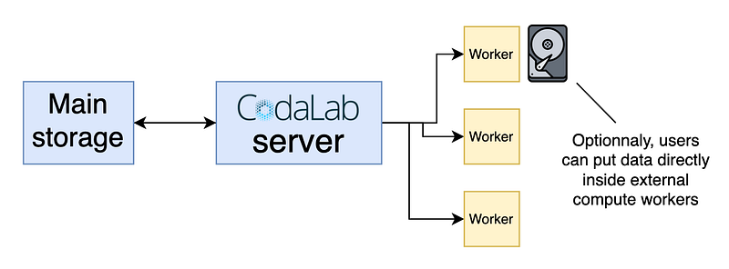

# Keep Confidential Data Private in AI Benchmark

## How to deploy **public benchmarks** on **protected data**?

AI competitions and benchmarks are [extremely effective ways](https://mlchallenges.com/benefits-challenges/) of crowdsourcing science and solving complex problems. However, giving public access to data is absolutely out of the question in certain application domains where the data are sensitive, typically in medicine, but also in areas such as finance, defense, or education.

Today, I'll show you methods that make it possible to bridge the gap and organize impactful benchmarks or competitions on protected data. We'll cover two approaches: **(1) using synthetic data** and **(2) performing blind evaluation of the algorithms**. Finally, I'll provide **recommandations** and show concrete — and simple — ways of implementing and **deploying such pipeline on the platform** [**Codabench**](https://www.codabench.org/).

## Method 1 – Using synthetic data

The first method to organize benchmark on sensitive data is to generate a synthetic version of the dataset. This means training a **generative model** to mimic the data, and creating a fake version of it, typically with non-existant patients or users.

The problem with this approach is that it relies on the generation methodology, makes it difficult to guarantee true privacy, and forces participants to study artificial data that may behave differently from real data.

- ✅ Can share the dataset to participants
- ❌ Tricky to have security guarantees
- ❌ Not working on the real data

## Method 2 – Blind evaluation of the algorithms

The second method consists in keeping the data hidden inside computing servers that receive participants' algorithms, evaluate them blindly on the data, and returns scores and logs output.

In this setup, the organizers keep a **full control on their dataset**, and the participants send their models as **code submissions**. It is more computationnaly demanding, but it guaranties data privacy and allows participants to work on the real data.

- ❌ Participants can't access the data their are working on
- ✅ Data security is guaranteed
- ✅ Working on the real data

## Recommandation

The second approach, **blindly evaluate algorithms in a closed environment**, is the prefered method. In order to help participants dive into the challenge, and have data at hand to be able to develop their solutions, organizers can use generative models (like in the first approach) to create and share a sample dataset. This way, participants have a clear idea of the dataset form, while the final evaluation is performed on the true dataset, guarded inside the computing machines.

## Concrete implementation

The platform [Codabench](https://www.codabench.org/) enables this design, making it possible to benchmark AI models on sensitive fields such as medecine, industry, or user data.

The setup is simple: as a competition organizer, you can connect your own computing resources (either _on premise_ or _cloud computing_) to your benchmark. The evaluation program is fully customizable and can read the data in the way you decide. By storing the data directly inside your machines, you ensure that nobody can access it, even if you benchmark is setup on Codabench's public server. You control the output scores, logs and plots participants receive to evaluate their solutions and populate the leaderboard.

Organizers keep a full control over their data, even if the benchmark is deployed on Codabench's public server.

This protocol was validated by [Dassault-Aviation](https://www.dassault-aviation.com/fr/) security engineers. Concrete implementation details are given in [Codabench's documentation](https://wiki.codabench.org/latest/Organizers/Running_a_benchmark/Compute-Worker-Management---Setup/#optional-put-data-directly-inside-the-compute-worker).

## Conclusion

Evaluating AI models on sensitive data is crucial across many application domains. To make this possible, two main strategies exist: creating synthetic versions of the data, or **evaluating submitted algorithms within a secure, closed environment**. The latter approach is generally preferred, and can be effectively implemented in the platform **Codabench**.

By enabling privacy-preserving evaluations while maintaining scientific rigor, such platforms make it possible to turn protected datasets into **public benchmarks**. This greatly accelerates research progress, and helps bridge the gap between real-world applications and open science.
