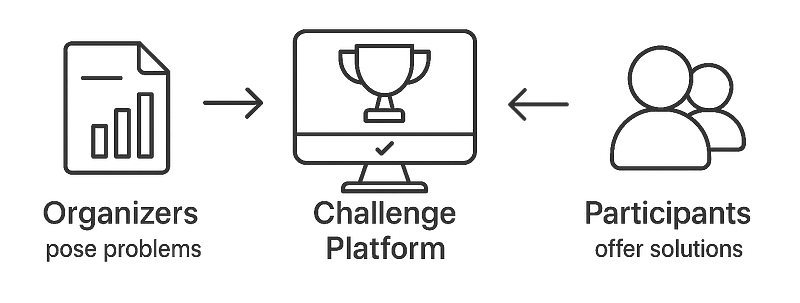
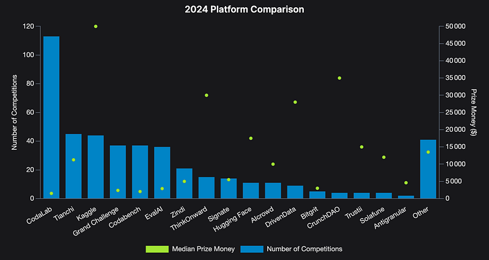
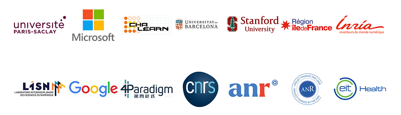

## 🌐 What is Codabench?

[Codabench](https://www.codabench.org/) is a web-based platform designed for organizing scientific challenges and benchmarks in Artificial Intelligence. In practice, the system allows AI algorithms to compete on various tasks, enabling the collaborative production of science across multiple fields, like medicine, physics, linguistics, economics, or ecology.is a web-based platform for organizing scientific challenges and benchmarks in Artificial Intelligence. The system allows AI algorithms to compete on various tasks, enabling collaborative scientific production across fields like medicine, physics, linguistics, economics, and ecology.

The platform is developed and hosted primarily in France 🇫🇷, at [LISN](https://www.lisn.upsaclay.fr/), Université Paris-Saclay.

## 📈 Key Statistics and Impact

Codabench and its predecessor CodaLab rank among the largest global actors in AI competitions, hosting one of the highest numbers of competitions worldwide.

*Number of major competitions organized across different platforms. Independent study by mlcontests.com.*

Two years after its official launch in August 2023, the main server counts:
- **30,000 users**
- **500 public competitions**
- Over **200,000 algorithm submissions** from participants

The platform continues rapid growth, attracting academic and industrial partners through innovative features and open science commitment.

## ⚙️ Main Features

⚙️ **Open Source** — The entire platform code is [open source](https://github.com/codalab/codabench/) and welcomes contributions, supporting transparent AI evaluation.

⚙️ **Containerized Environments** — Using Docker and Podman technologies to isolate test environments, ensuring reproducibility and simplifying logistics.

⚙️ **Decentralized Computing** — Organizers can connect their own compute resources to challenges, making the system fully scalable.

⚙️ **Flexibility** — Organizers can provide their own evaluation code, enabling virtually any experimental protocol.

⚙️ **Confidential Data** — Organizers retain full control over evaluation data, never requiring upload to the main server, enabling secure research.

## 👉 Join the Codabench Community

- Platform: [www.codabench.org](http://www.codabench.org)
- Code: [github.com/codalab/codabench](https://github.com/codalab/codabench/)
- Google Group: [groups.google.com/g/codalab-competitions](https://groups.google.com/g/codalab-competitions)
- Documentation: [wiki.codabench.org](https://wiki.codabench.org/latest/)
- White Paper: [arxiv.org/abs/2110.05802](https://arxiv.org/abs/2110.05802)
- Contact: [info@codalab.org](mailto:info@codalab.org)

