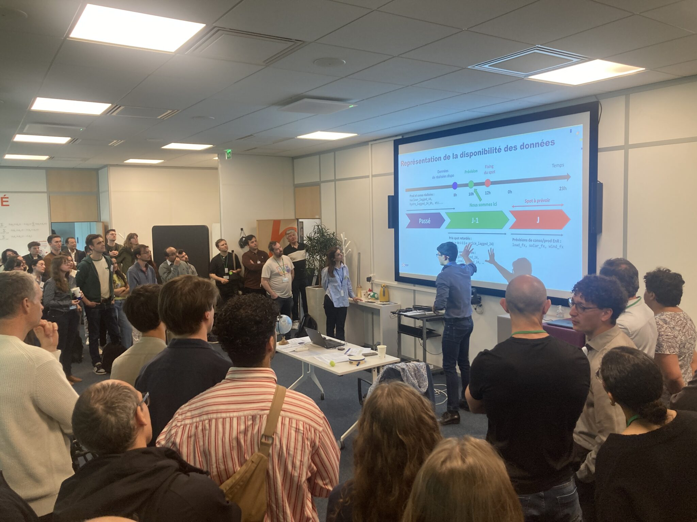
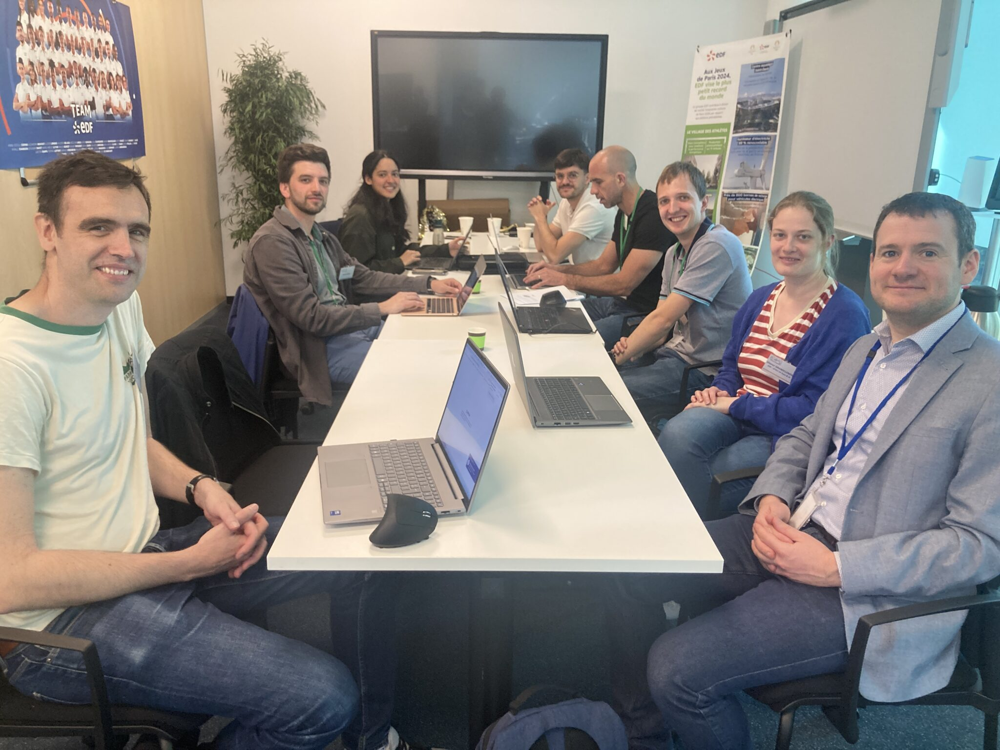

Électricité de France (EDF) held a hackathon on May 20th 2025. More than 120 participants competed to find the best price forecasting method in order to optimize electric cars charging.

*Introductory speech*

*The organizers*
