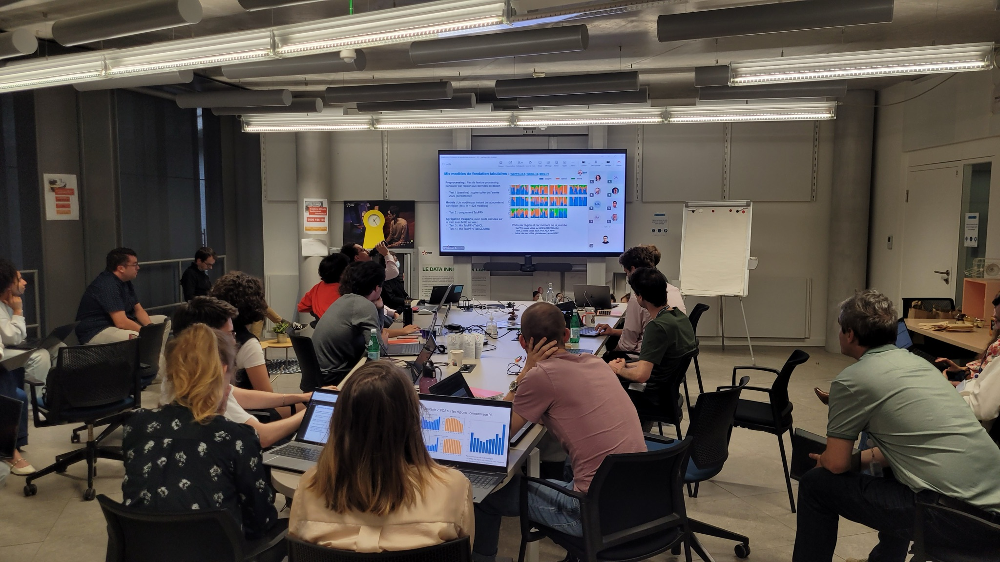

## The task

Participants received weather forecasts at 30-minute resolution for each administrative region of metropolitan France, and had to predict the regional wind power production for the intraday horizon.

## Why it matters

The power system has to keep supply and demand balanced at every horizon, from intraday to long term, and wind and solar output is hard to predict. As renewables take a bigger share of European generation, forecast errors weigh more on the decisions made at each of these horizons.

Today, several operational entities of EDF (DOAAT, SEI, Enedis) rely on ReEF (Renewable Energy Forecasts), a model built by EDF R&D on multilinear regression, for their daily solar and wind forecasts. ReEF served as the baseline, and the question was simple: can other kinds of models lower the forecast error, region by region and for France as a whole?

*Teams presenting their results*
